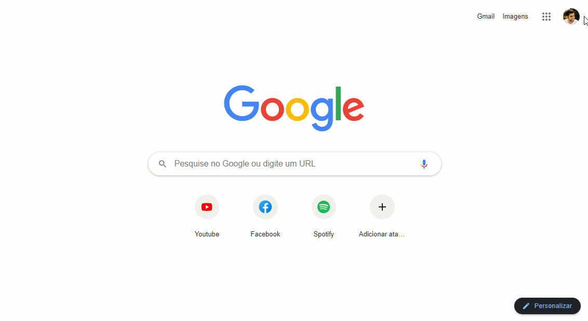

<h1 align="center">Clone da Home Page do Google</h1>

## Tecnologias

- HTML
- CSS

## Conceitos

- Conceito das **flexboxes** e suas propriedades

  - Usei o valor **flex** para a propriedade CSS `display` e as propriedades `align-items` e `justify-content` na maioria dos box container, para centralizar os elementos nos eixos principal e transversal

  - A propriedade do modelo flexbox que usei pela primeira vez, `flex-wrap`, possibilitou o resultado final da seção dos "Atalhos", em que cada atalho - que são flex items - quebram linha automaticamento devido ao "embrulho" feito pela propriedade

- **pseudo-elements**, como `::before` e `::after`, e o conceito de **positions**

  - No Header da página, usando o `::before` para criar o background circular do avatar, por exemplo, o entendimento do conceito de positions foi importante para chegar no resultado esperado

  - Outro uso para os valores de position foi no campo de pesquisa, para posicinar os icons, definindo o valor `relative` para a div que contêm o input e os icons 

  - No botão do footer, usei um `::after` com baixa opacidade para deixar o botão com uma luz interna quando estiver com o hover

- Usar a propriedade CSS `opacity` para esconder elementos 
  
  - Nos backgrounds do avatar e do icon, manipulei as opacidades para quando o box que contêm a imagem e o pseudo-element está ou não com o hover

- `padding` e o valor `100%`

  - Para fazer os botões de "More Apps" e de "Profile", usei a estratégia de definir `width` e `height` de `100%` para os elementos e, para controlar melhor o tamanho final dos backgrounds e das imagens, trabelhei com valores diferentes de padding

  - Para o campo de pesquisa também usei `width` e `height` de `100%` para o input e paddind ao redor. Coloquei o input em uma div para ter mais controle sobre o posicionamento dos icons e mais facilidade para estilizar o campo

- `white-space`, `overflow` e `text-overflow`

  - Para forçar o texto que fica na box de atalho a se manter em uma única linha. Quando ultrapassar o limite da caixa do texto, ocultar o conteúdo que estourou. E indicar com "..." que o conteúdo ultrapassou o limite da caixa

## Demonstração

  
